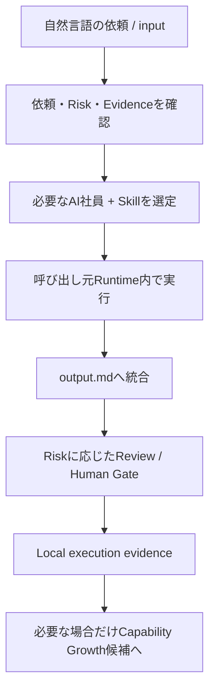

# AI Engineering Team

> 自然な言葉で受けた開発・設計・検証の依頼を、必要最小限の専門Role、Skill、品質ゲートで扱い、実務で使える成果物に整理するためのリポジトリです。

**決まった依頼フォーマットはありません。自然な言葉で自由に依頼できます。** 一言だけでも、背景や制約を含む詳しい依頼でも構いません。

このREADMEは、初めて利用する人が「何があるか」「どう始めるか」「何を信頼できるか」を把握するための入口です。詳細な仕様はリンク先のCanonical Documentationを正とします。

## このリポジトリでできること

このリポジトリには、AI Agentを専門職能ごとの「AI社員」として扱うための定義、Skill、Workflow、Review契約、テンプレート、検証コードがあります。依頼を Opinion / Design / Implementation / Verification に分類し、必要な担当だけを選んで、通常は1つの統合成果物へまとめます。

定義・Workflowがある対象領域は、次を含みます。

- 要件整理、MVPスコープ、顧客・現場課題の整理、アーキテクチャ
- Backend、Frontend、Full-stack、API、Database、外部SaaS/API連携
- Data Engineering、ETL / ELT、Analytics Engineering、Data Platform
- Cloud / Infrastructure、IaC、SRE / Platform、CI/CD・運用・インシデント対応
- Security / Governance、QA / Test Automation
- AI / ML、LLM、RAG、AI Agent、DevEx / Agent Workflow
- 性能、分散システム、Legacy Modernizationの設計・レビュー・検証観点

これは対象領域のRole/Skill/Workflowが実装されていることを示します。個別案件での成功率、工数削減、専門家を代替できることを示すものではありません。実案件での有効性は後述の「現時点の限界」を参照してください。

## これは何か、何ではないか

### これは何か

- 依頼をそのまま鵜呑みにせず、前提、MVP、リスク、保守性、運用性、セキュリティ、テストを確認するための共有Coreです。
- Roleの責任範囲、Skillの利用指針、Workflow、品質ゲート、成果物形式を再利用できるようにした運用リポジトリです。
- CodexまたはClaude Codeから、**呼び出し元のRuntime内で**使うことを前提にしたruntime-neutralな構成です。

### これは何ではないか

- 完全自律で何でも実装・本番反映するシステムではありません。
- Human Gate、専門家レビュー、利用者の確認を不要にするものではありません。
- 特定Provider・特定Modelに属するAI社員集ではありません。
- Role数やSkill数を増やすこと自体、またはValidatorのPASSだけを能力証明にする仕組みではありません。
- 他利用者のinput、output、Second Brain、raw feedbackを中央収集して改善する仕組みではありません。
- 秘密情報や個人情報を安全に扱えることを保証するDLP製品・秘密管理製品ではありません。

## 全体像

以下は、依頼を扱う標準的な判断の流れです。すべてのRoleを毎回使うのではなく、依頼とRiskに必要なものだけを選びます。



## 基本機能

### AI社員（Role）

AI社員は、依頼の担当範囲と判断責任を定義したRoleです。各Roleは単なる名称ではなく、`ai_team/capability_registry.yaml` と `ai_team/roles/` で次を持ちます。

- Responsibilities / Capabilities
- owns と does_not_own（責任を持つこと・持たないこと）
- Decision rights、Escalation conditions
- Handoff先と完了条件

現在、19 RoleがLifecycle Registryで `ACTIVE` として登録されています。例として、PMO、FDE、Tech Lead、Frontend / Backend / Full-stack、Data Engineer / Data Platform Engineer、Cloud / Infrastructure、SRE、Security、QA、LLM Application、ML、Integration、Product Manager、Knowledge Curatorがあります。全一覧と責任境界は [Role Scope Matrix](ai_team/role_scope_matrix.md) を参照してください。

`ACTIVE` は、共有Coreとしての定義と登録状態を表します。各Roleの実案件での有効性は、現時点では `not_evaluated`、すなわち **UNKNOWN — insufficient evidence** です。

### Skills

Skillは、Roleが依頼を扱う際の専門的な実行指針です。Roleが「誰がどこまで責任を持つか」を示すのに対し、Skillは「どのように依頼を進め、何を確認するか」を示します。

- `skills/*/SKILL.md`: 実行指針
- `skills/*/skill.yaml`: Skillメタデータ
- `skills/*/README.md`: 利用者向け説明
- `skills/*/agents/openai.yaml`: Runtime UI用アダプター。Role/SkillのIdentity Authorityではありません。

現在のSkill Registryには29 Skillがあります。19 Roleに対応する主要Skillと、FDEの10 Sub-skill（Discovery、業務フロー、Stakeholder、MVP、Engineering Handoff、Adoption、Metricsなど）で構成されます。全一覧は [Skills README](skills/README.md) を参照してください。

### Team Formation

依頼ごとに、Task type、曖昧さ、影響範囲、可逆性、外部依存、Production / Security / PII / data lossなどのRiskを見て、必要最小限のRoleとSkillを選びます。

- Roleを固定チームとして全員起動しません。
- Primary Roleが責任を持たない領域だけをSupporting Roleへhandoffします。
- Candidate Skillを通常タスクのActive Skillとして扱いません。
- High / Critical Riskの必須ゲートを省略しません。

選定ルールの詳細は [Risk-based Team Formation Workflow](ai_team/workflows/risk_based_team_formation_workflow.md) を参照してください。

### Workflowと成果物

依頼は原則として次の4 Modeへ分類されます。

| Mode | 主な用途 |
|---|---|
| Opinion | 妥当性、懸念、代替案、推奨の整理 |
| Design | 要件、構成、非機能、運用設計の整理 |
| Implementation | コード、SQL、設定、テストの作成・更新 |
| Verification | レビュー、再現、検証、修正案の整理 |

成果物は通常、`output/<client>/<YYYYMMDD>/<task-name>/output.md` に統合します。高Risk・複数工程・顧客提出・再利用物など、必要性ゲートを満たす場合だけ、計画・レビュー・証跡を `_internal/` に置きます。依頼入力と成果物はLocal Private Stateとして扱います。

詳細は [Input to Output Workflow](ai_team/workflows/input_to_output_workflow.md) と [Output Optimization Policy](ai_team/output_optimization_policy.md) を参照してください。

### Review / Quality Gate / Human Gate

作成者の確認と独立レビューは別物です。Risk-based Quality Gateでは、Riskに応じて必要な確認を変えます。

| Risk | 基本ゲート |
|---|---|
| Low | 作成者self-checkとrepository validation。独立レビューは任意。 |
| Medium | repository validationと独立品質レビュー。 |
| High | validation、automated test、独立専門レビュー、独立品質レビュー。 |
| Critical | unsafe executionの停止、High相当のレビュー、Celes Human Gate。 |

Canonical promotionには、Before / After Eval、Independent Review、Celes Human Gateが必要です。AIやPMOが専門ReviewerのP0/P1 Blockerを独断で解除することはできません。詳細は [Risk-based Quality Gates](ai_team/review/risk_based_quality_gates.yaml) を参照してください。

## Provider Neutral / Runtime-dependent Execution

AI社員のIdentity、Role、Capability、Quality StandardはProviderやModelから分離されています。一方、実行は呼び出し元Runtimeに従います。

```text
Codex      → AI Engineering Team → 現在のCodex Runtime内で実行
Claude Code → AI Engineering Team → 現在のClaude Code Runtime内で実行
```

- **Recommendation ≠ Enforcement**: Modelやeffortの推奨は、現在の設定を変更する命令ではありません。
- AI社員は呼び出し元のRuntime、Provider、Model、token sourceを上書きしません。
- AI社員が別Provider APIへ切り替える、cross-provider invocation、fallback、dynamic switchingは現在の契約で禁止されています。
- Model、token、costを実測・明示できない場合は推測せず `unavailable` と記録します。
- 別Runtimeが適している場合も、自動移行せず、制約とhandoff候補として報告します。

CodexとClaude Code向けのガイドはありますが、Runtimeを選択・起動するrouterではありません。利用者は使用中のRuntimeでこのリポジトリを開いてください。詳細は [Runtime Selection Policy](ai_team/runtime_selection_policy.md)、[Codex guide](codex_team_execution.md)、[Claude Code guide](claude_code_team_execution.md) を参照してください。

## Second BrainとPersonalization

Second Brainは、現在の利用者だけが任意で使えるLocal Private Stateです。なくてもAI社員チームはShared Coreだけで継続します。

判断時の優先順位は次のとおりです。

1. Current Explicit Request
2. Current Evidence（現在のリポジトリ、コード、データ、設定、Runtime、input）
3. User-local Second Brain
4. Shared AI Employee Core
5. General Model Knowledge

- Current EvidenceとSecond Brainが矛盾する場合、Current Evidenceを優先します。
- 利用者の明示指定、`SECOND_BRAIN_ROOT`、利用者ローカル設定のいずれかでrootを解決できる場合だけ使います。
- home directoryを探索しません。他利用者のSecond Brainを読取・同期しません。
- 文体や詳細さなどの個人の好みを、Universal Capabilityへ自動昇格させません。
- Second Brainの内容をGit commit、telemetry、remote syncへ出すことは禁止されています。

書き込みは、現在利用者からの明示依頼、または `Accepted` かつ再利用価値がありrootが確認できた場合だけ候補になります。詳細は [Local Context and Personalization Policy](ai_team/personalization_policy.md) と [Local Second Brain Policy](ai_team/obsidian_write_policy.md) を参照してください。

## Capability GrowthとLifecycle

### Single-Authority Capability Growth

公式AI Engineering TeamのCanonical Growth Authorityは **Celes環境だけ**です。他の利用者はGitHubからclone / pullしてローカル利用できますが、その利用者のinput、output、raw evidence、Second Brain、raw feedback、private dataを自動収集・自動同期して公式Capability Growthへ反映することはありません。

正式な成長は、実務Evidenceを出発点にした次の流れです。

```text
Real Work
→ Local Evidence
→ Capability Gap
→ Improvement Proposal
→ Candidate
→ Before / After Eval
→ Independent Review
→ Celes Human Gate
→ PROMOTE / REJECT / ROLLBACK
```

Evidenceが不足する場合の結論は **UNKNOWN — insufficient evidence** です。Candidateの作成者は自己承認できず、Canonical promotionを自動commit・自動pushしません。詳細は [Capability Growth Policy](ai_team/governance/capability_growth_policy.yaml) と [Capability Growth Workflow](ai_team/workflows/capability_growth_workflow.md) を参照してください。

### AI Employee Lifecycle

AI Employee RegistryのLifecycleは次の状態を持ちます。

```text
DISCOVERED → PROPOSED → CANDIDATE → EVALUATED
→ INDEPENDENTLY_REVIEWED → HUMAN_GATE → ACTIVE
```

`DEPRECATED` は登録済みRoleを廃止する状態です。`REJECTED` と `ROLLED_BACK` はCapability Growthの意思決定結果であり、AI Employee Lifecycleの状態名ではありません。Roleの作成・変更を `ACTIVE` にするには、評価、独立レビュー、Celes Human Gateが必要です。

### Skill Lifecycle

Skillも同じく `DISCOVERED` から `ACTIVE`、`DEPRECATED` までのLifecycleを持ちます。新Skillは、EvidenceのあるCapability Gapがあり、既存Skill更新・統合・Workflow・Documentation・Toolなどでは解決できず、再利用可能かつ評価可能な場合だけ候補にできます。

現在のRegistryでは、19 Roleは `ACTIVE`、29 Skillは `ACTIVE` と登録されています。ただし、これは構造・統制上の登録状態です。Live usage evidenceがないため、Role / Skill effectivenessは `not_evaluated` です。

## Local Privacy BoundaryとGit Safety

利用者・顧客固有の情報は共有Coreと分離します。少なくとも次はLocal Private Stateとして扱う契約です。

- `input/`、`output/`、`_internal/`、intermediate artifacts
- execution evidence、raw reviewer findings、raw human feedback、raw retrospectives
- `.local/`、Second Brain、顧客・案件情報
- credentials、secrets、tokens、raw/private source

`.gitignore`はこれらの代表的なパスを除外し、`tools/validate_repository.py` はtracked private path、秘密情報らしい文字列、個人の絶対パス、共有Coreにおけるcross-provider codeなどを検査します。Architecture ContractはLocal Private Stateのファイル権限をdirectory `0700`、file `0600` とすることも求めています。

ただし、これは完全な安全性の保証ではありません。秘密情報を入力しないこと、必要ならマスク・匿名化すること、顧客データ・PII・契約情報を最小限にすることは利用者の責務です。Validatorの検出パターンには限界があり、暗号化、アクセス制御、外部共有の安全性をこのリポジトリ単独で保証しません。

## 利用するメリット

- 依頼に合わせて専門Role、Skill、Reviewを選び、責任境界を見える形にできます。
- 意見・設計・実装・検証を区別し、成果物を原則 `output.md` に統合できます。
- Provider/ModelにRole Identityを固定せず、使用中のRuntimeを維持できます。
- Riskに応じた独立レビューとHuman Gateの契約があります。
- CandidateとACTIVE、構造契約と実案件有効性を分けて扱えます。
- Second Brainを任意かつ利用者ローカルで使えます。
- Validator、foundation regression test、deterministic foundation evalで、共有Coreの構造的な破損を検出できます。

## デメリットと留意点

- すべてが自動ではありません。高Riskの変更は人間のレビューや承認が必要です。
- AIの判断・出力は常に正しいわけではなく、専門家の確認が必要な領域があります。
- Role、Skill、Workflow、Evalを維持する運用コストがあります。
- Runtimeごとに利用可能な機能・Model・権限は異なり得ます。
- Second Brainを使うには、利用者がrootを明示またはローカル設定する必要があります。
- token / costは常に取得できるわけではありません。
- 本番データ、不可逆操作、schema migration、infrastructure変更、認証認可、secrets、PII、規制・財務影響がある依頼は、出力をそのまま投入してはいけません。

## Quick Start

### 1. リポジトリを取得する

```bash
git clone <repository-url>
cd data_engineer
```

### 2. 必要なら検証用のPython環境を用意する

共有CoreのValidator/Test/Evalを実行する場合は、`requirements-dev.txt` の依存関係を入れます。

```bash
python3 -m venv .venv
source .venv/bin/activate
python3 -m pip install -r requirements-dev.txt
```

### 3. 使用中のRuntimeでリポジトリを開く

CodexまたはClaude Codeで、このリポジトリを開きます。AI社員チームは、開いたRuntime内で作業します。別のProviderやModelをAI社員が自動で選ぶことはありません。

### 4. 自然な言葉で依頼する

チャットに直接書いても、依頼文・資料・ログを `input/` に置いても構いません。ローカル資料を置く場合は、次のように案件単位で整理できます。

```text
input/example-client/request.md  # 匿名の記載例
input/<client>/<task>.md
```

`input/` はprivate扱いです。APIキー、パスワード、接続文字列、個人情報、未マスクの顧客機密情報は置かないでください。

### 5. 成果物を確認する

標準成果物は次に作られます。

```text
output/<client>/<YYYYMMDD>/<task-name>/output.md
```

High Risk、複数工程、顧客提出、再利用などに該当する場合だけ、`_internal/` に計画・レビュー・証跡が追加されます。

### 6. 必要な検証を実行する

```bash
# repository構造・privacy・runtime-neutralityなどの検証
python3 tools/validate_repository.py

# shared foundation regression tests
python3 -m unittest discover -s ai_team/tests -p 'test_*.py' -v

# deterministic foundation eval
python3 ai_team/evals/run_foundation_evals.py
```

これらのPASSは、Role / Skill / Lifecycle / canonical ownership / privacy / provider-neutralityなどの**構造契約**が通ったことを示します。Live AIの実案件成功、human correction削減、token/cost削減、Role/Skill effectivenessを証明するものではありません。

## 依頼方法

**決まった依頼フォーマットを使う必要はありません。普通の言葉で、自由に依頼できます。**

例えば、次の一文から始められます。

```text
SnowflakeのTaskを使ってRAWからSTGへ1時間ごとに差分更新したい。
現在の構成を確認して、設計、SQL、テスト観点までお願い。
```

短い依頼でも大丈夫です。

```text
このエラーを直して。
```

```text
このアーキテクチャをレビューして。
```

```text
このSQLを高速化して。
```

```text
Terraform変更の影響範囲を調べて。
```

```text
この機能を設計・実装・テストして。
```

依頼からRole、Mode、Risk、必要なSkillを判断します。指定したい場合だけ、任意のワンライナータグも使えます。

```text
@role:data_engineer
@mode:design
@light
@full
```

タグは必須ではありません。`@light` は軽量出力を、`@full` は必要な詳細成果物を希望する目安です。詳細は [Output Optimization Policy](ai_team/output_optimization_policy.md) を参照してください。

## 任意の依頼フォーマット

**これは任意の参考フォーマットです。使用は強制ではありません。空欄があっても問題ありません。自然文だけでも依頼できます。**

```markdown
## 依頼内容
何をしてほしいか自由に書いてください。

## 背景
なぜ必要なのか。分かる範囲で構いません。

## 対象
対象のコード、システム、データ、ファイル、ディレクトリなど。

## 期待する成果物
設計書、コード、SQL、レビュー、調査結果など。
分からなければ空欄で問題ありません。

## 制約
使用技術、変更禁止箇所、期限、セキュリティ条件など。

## 参考情報
関連ファイル、ログ、URL、過去経緯など。

## 重視したいこと
- 正確性
- 速度
- コスト
- セキュリティ
- 保守性
- 分かりやすさ

## 補足
その他自由記述。
```

## 対応する依頼の例

Role / Skill / Workflowに定義がある依頼例です。個別の技術スタック、外部サービス仕様、実行権限は依頼時のEvidenceで確認します。

| 依頼例 | 主に使うRoleの例 |
|---|---|
| API、業務ロジック、DB設計、外部連携 | Backend / Integration Engineer |
| 画面、UX、フロント実装、MVP | Frontend / Full-stack Engineer |
| ETL / ELT、SQL、データ品質、DWH | Data Engineer |
| データアーキテクチャ、カタログ、共通基盤 | Data Platform Engineer |
| Cloud、Terraform、ネットワーク、IAM | Cloud / Infrastructure Engineer |
| 監視、SLO、障害、リリース安全性 | SRE / Platform Engineer |
| 脅威分析、認証認可、secrets、privacy | Security / Governance Engineer |
| テスト設計、自動化、回帰検証 | QA / Test Automation Engineer |
| RAG、LLMアプリ、AI Agent、eval | LLM Application Engineer |
| 学習・評価パイプライン、MLOps | ML Engineer |
| 要件、優先順位、MVP、現場導入 | Product Manager / FDE |
| 設計レビュー、性能・Legacy・分散システムの検討 | Tech Leadと該当専門Role |

## 品質保証の考え方

信頼できる根拠と、まだ証明されていないことを分けます。

- **Evidence before Improvement**: 実務Evidenceなしに「改善済み」と断定しません。
- **Candidate / ACTIVE separation**: Candidateは評価・レビュー・Human Gateを通るまでCanonical Active扱いにしません。
- **Independent Review**: 作成者のself-checkは独立レビューの代わりになりません。
- **Risk-based Quality Gate**: 影響が大きいほど、専門レビューとHuman Gateを増やします。
- **Regression protection**: Validator、foundation tests、deterministic evalで構造契約の後退を検出します。
- **Before / After Eval**: Capability Growthでは同一Eval contractで比較します。
- **UNKNOWN — insufficient evidence**: live Evidenceがない有効性・コスト・効率は不明のままにします。

## 現時点の限界

次は、このリポジトリの現時点のEvidenceからは断定できません。

| 項目 | 現在の状態 |
|---|---|
| Real-world effectiveness | **UNKNOWN — insufficient evidence** |
| Role / Skill effectiveness | Registryでは `not_evaluated` |
| Token efficiency | 計測がなければ `unavailable` |
| Cost reduction | 計測がなければ `unavailable` |
| Human correction reduction | **UNKNOWN — insufficient evidence** |
| 実案件での再現性・成功率 | **UNKNOWN — insufficient evidence** |

Foundation EvalのPASSはdeterministicな構造契約の合格です。実運用の性能評価、利用者満足、ROI、専門家レビュー不要を意味しません。

## 向いている人

- AIを開発パートナーとして使いたい個人開発者、小規模チーム
- Software / Backend / Frontend / Full-stack Engineer
- Data Engineer、Analytics Engineer、Data Platform Engineer
- Cloud / Platform Engineer、SRE、Security Engineer、QA Engineer
- AI / ML / LLM / RAG Engineer
- Technical Lead、Architect、Product Manager、Consultant、FDE
- 設計、実装、レビュー、ドキュメント作成を、責任境界と品質ゲート付きで進めたい人

## ディレクトリ構成と主要ドキュメント

```text
.
├── README.md                       # この入口
├── AGENTS.md                       # AI Agentが作業する際の最上位ルール
├── CLAUDE.md                       # Claude Code向けの補足ガイド
├── ai_team/                        # Role、Policy、Workflow、Review、Governance、Eval
├── skills/                         # Skill定義と利用説明
├── templates/                      # 設計・実装・テスト・運用などのテンプレート
├── input/                          # 利用者ローカルの依頼・資料
├── output/                         # 利用者ローカルの成果物
├── tools/validate_repository.py    # shared repository validator
├── ai_team/tests/                  # shared foundation regression tests
├── ai_team/evals/                  # deterministic foundation eval
├── codex_team_execution.md         # Codexからの実行ガイド
└── claude_code_team_execution.md   # Claude Codeからの実行ガイド
```

最初に読む候補は次です。

- [AI Team Overview](ai_team/team_overview.md)
- [Role Scope Matrix](ai_team/role_scope_matrix.md)
- [Request Mode Policy](ai_team/request_mode_policy.md)
- [Runtime Neutral Design Policy](ai_team/runtime_neutral_design_policy.md)
- [Capability Registry](ai_team/capability_registry.yaml)
- [AI Employee Lifecycle Registry](ai_team/governance/ai_employee_lifecycle_registry.yaml)
- [Skill Lifecycle Registry](ai_team/governance/skill_lifecycle_registry.yaml)
- [Canonical Sources](ai_team/governance/canonical_sources.yaml)

## FAQ

### 決まったフォーマットで依頼する必要がありますか？

いいえ。自然な文章で自由に依頼できます。参考フォーマットは任意です。

### CodexとClaude Codeのどちらで使えますか？

両方のRuntime向けガイドがあります。実行は、利用者が開いているCodexまたはClaude CodeのRuntime内で完結します。AI社員は別Runtimeを自動起動しません。

### AI社員は特定Modelに固定されていますか？

いいえ。AI社員のIdentityにはProviderやModelを固定しません。実行時は呼び出し元Runtimeの現在のModelとtoken sourceを使い、Model / effortの推奨は非拘束です。

### すべて自動で実装・本番反映されますか？

いいえ。High / Critical Riskでは独立レビューが必要で、Critical操作とCanonical promotionにはCeles Human Gateが必要です。出力を無条件で本番投入しないでください。

### Second Brainは必須ですか？

いいえ。rootを解決できる場合だけ利用する任意のLocal Private Stateです。なくてもShared Coreを使って作業を継続します。

### 他利用者に自分のinput / outputは見えますか？

共有Coreへ自動収集・自動同期する設計ではありません。`input/`、`output/`、`_internal/`、Second Brainなどはprivate扱いでGit除外・Validator検査の対象です。ただし、秘密情報の混入を完全に防ぐ保証ではないため、入力前のマスク・最小化は必要です。

### AI社員やSkillは増えますか？

EvidenceのあるCapability Gapを起点に、Candidate、Before / After Eval、Independent Review、Celes Human Gateを通る場合だけ追加・変更・昇格できます。数を増やすこと自体は目的ではありません。

## 変更・運用時の最低限チェック

- `input/` と既存 `output/` を確認する。
- 目的、前提、MVP、スケール時の拡張余地、設計・運用・データ品質・セキュリティRiskを整理する。
- 呼び出し元Runtimeを維持し、未確認のModel / token / costを推測しない。
- 実行した検証、未実行検証、残存Riskを成果物に記録する。
- 破壊的変更には理由、影響範囲、移行、ロールバックを付ける。
- 顧客提出、本番影響、security、再利用物はRisk-based Quality Gateを適用する。

詳しい作業ルールは [AGENTS.md](AGENTS.md) を参照してください。
